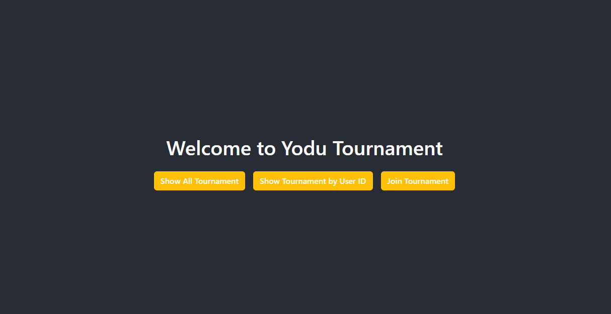
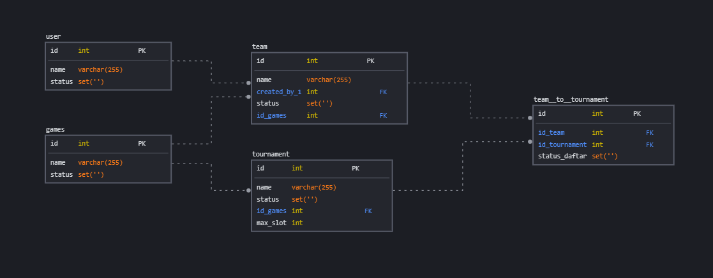

## Yodu tournament app



## Tech Stack
This project is build with Flask as back end server and ReactJS as the interface


## Database Configuration

First of all, you have to configure the database, you might be adjusting the username and password depending on your MySQL that installed on your device, in this case the configuration using <b>root/root</b> as username and password

Create your database first:

```
CREATE DATABASE yodu_tournament
```


Now, you're good to go!

## Database Model & Seeders

Database model:




This project has dummy data that will added by the time you run the server, you can check for more info in seeders/seeder

## How to run it

Clone the project:

```
git clone https://github.com/fixmannn/yodu-tournament.git
```

Go to the project directory:

```
cd yodu-tournament
```


### Start the server:

Back end:


```
cd backend
```

```
pip install -r requirements.txt
```

```
flask --app app run
```

Front end:
```
cd frontend
```
```
npm install
```

```
npm start
```

# API Endpoint
| Method | Endpoint                                   | Description                                                   |
|--------|--------------------------------------------|---------------------------------------------------------------|
| GET    | /recommended_tournament                    | Get the list of all active tournament which open registration |
| GET    | /recommended_tournament/{user_id}          | Get the list of a tournament based on user_id                 |
| GET    | /join_tournament/{team_id}/{tournament_id} | Check if a team is joinned a tournament or not                |
| POST   | /join_tournament/{team_id}/{tournament_id} | Register a team to a tournament                               |